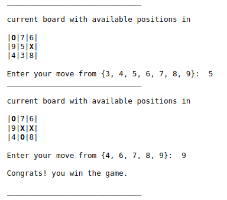
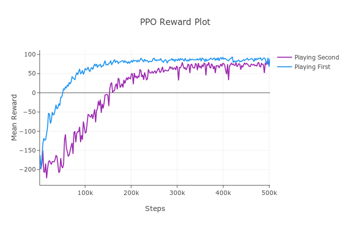

# Quixo with Reinforcement Learning

Custom Gym environment for the Quixo board game with a shaped reward
function, and three RL agents (PPO, DQN, A2C) trained on top via
Stable Baselines3. A Monte-Carlo value baseline and a heuristic
deterministic player are included as references.

<p align="center"></p>
<p align="center"><em>Pygame GUI: agent vs. human, with the available action highlighted.</em></p>

## Table of Contents

1. [Overview](#overview)
2. [Installation](#installation)
3. [Quickstart](#quickstart)
4. [The Quixo Environment](#the-quixo-environment)
5. [Agents](#agents)
6. [Results](#results)
7. [Repository Layout](#repository-layout)
8. [Disclaimers and Attribution](#disclaimers-and-attribution)

## Overview

Quixo is a two-player 5x5 sliding board game with a high branching
factor (44 legal actions per state). The hard part is not the rules but
the reward: a naive sparse "win = 1, loss = -1" signal makes RL agents
struggle to discover useful play. The contribution here is a shaped
reward and an action-masking step function that gives PPO, DQN, and A2C
a reasonable learning signal in under 500k steps each.

## Installation

```bash
pip install -r requirements.txt
```

Pinned to `gym 0.21`, `stable-baselines3 1.7.0`, `numpy 1.26`.

## Quickstart

```bash
# 1. Train PPO, DQN, A2C in sequence (writes checkpoints to ./models)
python train.py

# 2. Round-robin: each trained agent vs. Random and vs. Deterministic, 1000 episodes
python evaluate.py

# 3. Quick PPO vs. RandomPlayer match printed to stdout
python main.py

# 4. Optional: open the pygame GUI to play against a trained agent
python gui.py
```

## The Quixo Environment

`envs.py` exposes `QuixoEnv(player: int)` which wraps `gym.Env`.

- **Action space**: `Discrete(44)`. Only the 16 border cells can be
  picked up, each with up to 3 valid slide directions; the env masks
  invalid moves at step time.
- **Observation space**: `Box(low=-30, high=30, shape=(44 + 25,),
  dtype=int32)`. The first 44 components encode legality and direction
  hints per action; the remaining 25 are the flattened 5x5 board with
  `{-1, 0, 1}` for empty / player-0 / player-1.
- **Reward shaping**: dense signal that penalises illegal picks
  (`-3`), rewards moves that extend an own line, penalises moves that
  extend an opponent line, and bonuses a winning move (`+10`). Without
  this, learning curves on Quixo are flat for ~1M steps.

`QuixoEnvV1` is the first iteration with a simpler reward; kept in
the file for ablation.

## Agents

| Name | Type | Source |
| ---- | ---- | ------ |
| `RandomPlayer` | uniform-random over legal moves | `players.py` |
| `DeterministicPlayer` | heuristic (extend the longest own line, block opponent) | `players.py` |
| `ValuePlayer` | Monte-Carlo value-iteration on board hashes | `players.py` + `models.ValueClass` |
| `PPOPlayer` | wrapper around a PPO checkpoint trained on `QuixoEnv` | `players.py` + `models.PPOWrapper` |
| `DQNPlayer` | DQN checkpoint | `players.py` + `models.DQNWrapper` |
| `A2CPlayer` | A2C checkpoint | `players.py` + `models.A2CWrapper` |

The three RL wrappers share the same `train(ts, callbacks, verbose)` /
`experiment(steps)` interface so swapping algorithms is a one-line
change in `train.py`.

## Results

Each agent is trained for 500k steps on the same shaped environment and
then evaluated over 1000 games against `RandomPlayer` and
`DeterministicPlayer`.

<p align="center"></p>
<p align="center"><em>PPO mean episode reward over 500k training steps with the shaped reward function.</em></p>

The three RL agents all comfortably beat `RandomPlayer`. PPO is the
most consistent against `DeterministicPlayer`; DQN converges fastest
but plateaus lower; A2C is the noisiest.

## Repository Layout

```
.
|- game.py          Quixo board, Move enum, Player base class
|- envs.py          QuixoEnvV1 + QuixoEnv (shaped reward, action masking)
|- models.py        ValueClass + PPOWrapper + DQNWrapper + A2CWrapper
|- players.py       RandomPlayer, ValuePlayer, PPOPlayer, DQNPlayer, A2CPlayer, DeterministicPlayer
|- utils.py         play_game, get_available_actions, evaluate, dict IO
|- train.py         trains PPO, DQN, A2C in sequence
|- evaluate.py      round-robin RL vs. Random / Deterministic, 1000 episodes
|- main.py          one-off PPO vs. Random match
|- gui.py           pygame GUI to play against a saved agent
|- tutorial.ipynb   walk-through notebook
|- models/          saved checkpoints (PPO / DQN / A2C zip files + value dict json)
|- docs/            screenshots used in this README
|- Quixo.pdf        full project report
```

## Disclaimers and Attribution

All code in this repository (the Gym environment, the reward shaping,
the agent wrappers, the heuristic and value-iteration baselines, the
GUI, the evaluation loop) is original work for the course project. The
dependencies are upstream as is:

- [`stable-baselines3`](https://github.com/DLR-RM/stable-baselines3)
  provides PPO, DQN, A2C, the callback infrastructure, and
  `evaluate_policy`.
- [`gym`](https://github.com/openai/gym) (0.21) provides the `Env`,
  `Discrete`, and `Box` primitives.

No upstream policy or environment fork. The Quixo rules implementation
in `game.py` follows the boardgame as published by Gigamic; the board
representation, move generation, and reward shaping are mine.
